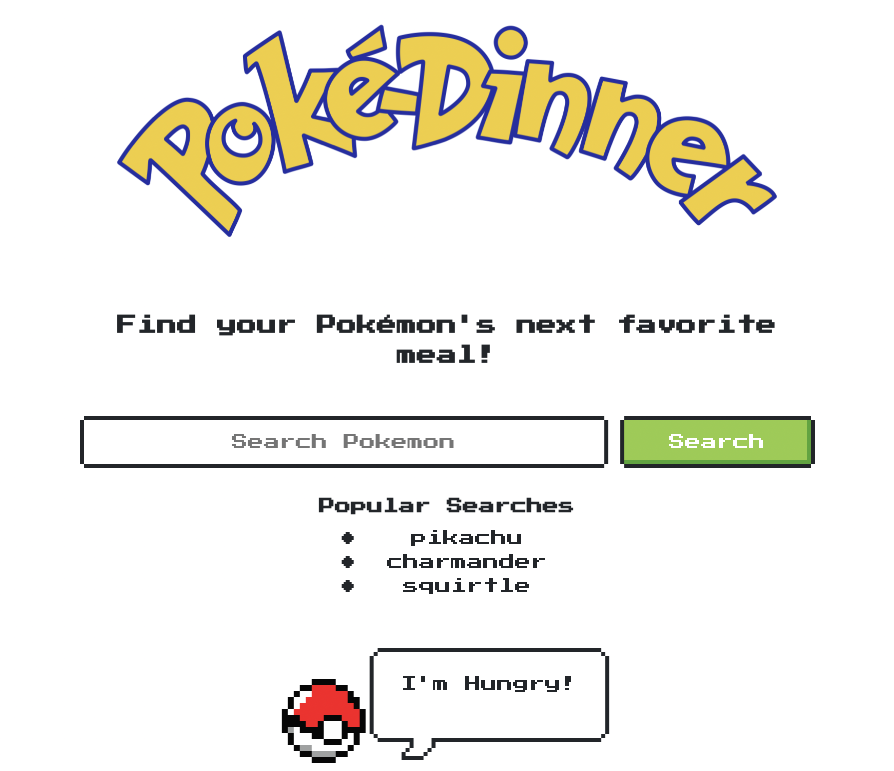

# Poké-Dinner

## Purpose
A web application that allows user to input the name of a Pokémon, and returns results of dinner recipe ideas to feed said Pokémon based on recommended caloric intake for Pokémon's weight range.
## Built With
- HTML
- CSS
- JavaScript
- NES CSS
- [PokéApi](https://pokeapi.co/)
- [Spoonacular Recipe Search API](https://spoonacular.com/food-api)
## Website
[PokeDinner](https://vinssm.github.io/PokeDinner/)
 
## Limitations
- Spoonacular Recipe Search API is limited to 150 fetch requests per day
- PokéAPI is limited to only first generation Pokémon
## Contribution
Created by [Vinay](https://github.com/vinssm), [James](https://github.com/jtdprogramming), and [Christiana](https://github.com/NicaVulcan)
